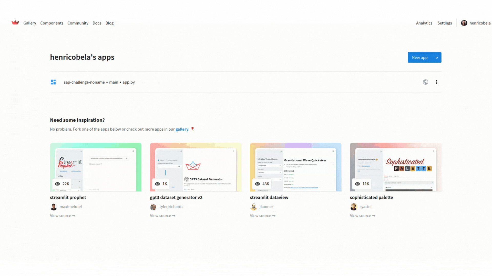

# PROJETO SAP HORUS


> O projeto SAP HORUS, foi desenvolvido junto a empresa SAP, afim de sanar uma dor muito importante não só de varejistas, mas tambem de estoque em geral. O projeto gira em torno de uso de Visão computacional para identificar certos produtos dentro do estoque, e criar uma descrição dos mesmos (Utilizando o ChatGPT), assim como controlar o estoque destes produtos e poder tirar novos insights para o negocio. 

---

### Roadmap


O projeto está em desenvolvimento e as próximas atualizações serão voltadas nas seguintes tarefas:

- [x] ChatGPT+MVP
- [x] Conectividade Multiplataforma
- [ ] Modelo preditivo melhorado
- [ ] SAP Mech

---

## 💻 Pré-requisitos

Para rodar o app localmente, são necessários os seguintes recursos:

* Você instalou a versão mais recente de `<Python / VSCode>`
* Você tem uma máquina `<Linux / Windows>`. Importante observar que o projeto funciona melhor em maquinas Linux.
> * Alternativa: utilizar o app em outro dispositivo, será necessário o deploy do aplicativo em alguma ferramenta de deploy.
> * Um dispositivo que possua uma camera, é necessário para realizar a detecção do objeto escolhido no treinamento do modelo de IOD. (Image Object Detection)
* Você instalou as bibliotecas `<scikit-learn / open-cv / tensorflow / pytorch / streamlit / openai / numpy / pandas / keras>`.

---

## 🚀 Como executar o app localmente

Para iniciar o aplicativo locamente, siga estas etapas:

Em seu terminal, navegue até a pasta de onde você clonou o repositório:
```
cd seu_diretorio/sap-challenge-noname
```

Executar o aplicativo streamlit:
> Lembrando que, será necessário a configuração de seu ambiente streamlit tanto em sua maquina, quanto em sua conta no streamlit.io.
```
streamlit run app.py
```

---

## ☕ Utilizando o app á partir de um Deploy

Á partir da escolha de sua ferramenta de deploy, será necessário um endpoint para que a aplicação funcione, neste caso, utilizamos o deploy no streamlit.

Acesse o site streamlit.io
```
https://streamlit.io/
```



---

## 📫 Utilizando o Horus

Abaixo há um gif demonstrando a aplicação e como utiliza-la. Tambem um descritivo de cada parte do app.

1. Preencher Horus com dados do produto:
> É possivel realizar o upload de uma base de dados excel para o app, e assim, solicitar para que o Horus realize o preenchimento da coluna de descrição, com base na coluna desejada.

2. Preencher dados do produto:
> Nesta seção, você pode adicionar um novo produto á sua base de dados, e pedir para que o Horus faça a descrição deste novo produto.

3. Detectar produtos:
> É aqui que a cereja do bolo entra, nesta parte do app, é possivel utilizar a Inteligência Artificial que a NoName criou, para detectar automaticamente qual o produto escolhido no treinamento da IA. No caso, atualmente a nossa I.A. funciona com detecção de 2 produtos, Coca e Fanta Laranja. 
> Há 2 tipos de detecção, via video e via foto, onde voce pode utilizar de uma camera de qualquer dispositivo, e realizar a detecção.
> O Horus está intrinssicamente ligado á Visao Computacional desta parte do aplicativo, entao, ao detectar o produto, o Horus automaticamente gera a descrição e guarda no banco de dados.

4. Atualizar Horus
> É possivel realizar uma atualização da base de dados, subindo um novo arquivo excel, com opção de apagar ou não a base antiga.


---

## 🤝 NoName

Membros:

<table>
  <tr>
    <td align="center">
      <a href="#">
        <br>
        <sub>
          <b>Henrico Bela</b>
        </sub>
      </a>
    </td>
    <td align="center">
      <a href="#">
        <br>
        <sub>
          <b>Emilly Gabrielly</b>
        </sub>
      </a>
    </td>
    <td align="center">
      <a href="#">
        <br>
        <sub>
          <b>Felype Nunes</b>
        </sub>
      </a>
    </td>
    <td align="center">
      <a href="#">
        <br>
        <sub>
          <b>Sara Leal</b>
        </sub>
      </a>
    </td>
    <td align="center">
      <a href="#">
        <br>
        <sub>
          <b>Daniel Faria</b>
        </sub>
      </a>
    </td>
  </tr>
</table>

## 📝 Licença

Esse projeto está sob licença. Veja o arquivo [LICENÇA](LICENSE.md) para mais detalhes.