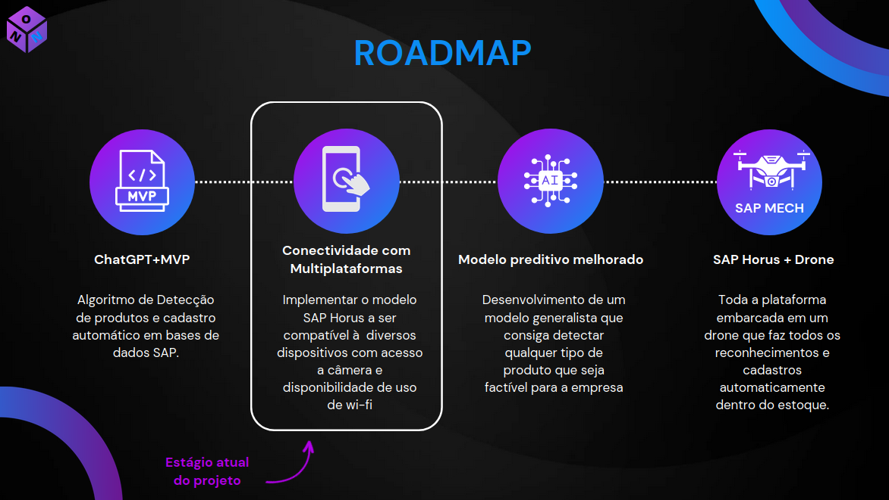

# PROJETO SAP HORUS


> O projeto SAP HORUS, foi desenvolvido junto a empresa SAP, afim de sanar uma dor muito importante não só de varejistas, mas tambem de estoque em geral. O projeto gira em torno de uso de Visão computacional para identificar certos produtos dentro do estoque, e criar uma descrição dos mesmos (Utilizando o ChatGPT), assim como controlar o estoque destes produtos e poder tirar novos insights para o negocio. 

### Roadmap



O projeto está em desenvolvimento e as próximas atualizações serão voltadas nas seguintes tarefas:

- [x] xxxx
- [x] xxxx
- [x] xxxx
- [x] xxxx
- [x] xxxx

## 💻 Pré-requisitos

xxxx:

* Você instalou a versão mais recente de `<Python / xxxx / xxxx>`
* Você tem uma máquina `<xxxx>`. Importante observar que o projeto funciona melhor em maquinas xxxx.
* Você instalou as bibliotecas `<xxxx>`.

## 🚀 xxxx

Para iniciar a xxxx, siga estas etapas:

xxxx:
```
xxxx
```

xxxx:
```
xxxx
```

xxxx:
```
xxxx
```

xxxx
xxxx

```
xxxx
```

xxxx
```
xxxx
```


## ☕ xxxx

xxxx

xxxx
```
xxxx
```

xxxx
```
xxxx
```

xxxx

## 📫 xxxx

xxxx

1. xxxx:

    xxxx


2. xxxx:

    xxxx


3. xxxx: 

    xxxx.


4. xxxx:

    xxxx


5. xxxx:

    xxxx
    ```
    xxxx

    ```


6. xxxx:

    xxxx.


xxxx

xxxx


## 🤝 NoName

Membros:

<table>
  <tr>
    <td align="center">
      <a href="#">
        <br>
        <sub>
          <b>Henrico Bela</b>
        </sub>
      </a>
    </td>
    <td align="center">
      <a href="#">
        <br>
        <sub>
          <b>Emilly Gabrielly</b>
        </sub>
      </a>
    </td>
    <td align="center">
      <a href="#">
        <br>
        <sub>
          <b>Felype Nunes</b>
        </sub>
      </a>
    </td>
    <td align="center">
      <a href="#">
        <br>
        <sub>
          <b>Sara Leal</b>
        </sub>
      </a>
    </td>
    <td align="center">
      <a href="#">
        <br>
        <sub>
          <b>Daniel Faria</b>
        </sub>
      </a>
    </td>
  </tr>
</table>

## 📝 Licença

Esse projeto está sob licença. Veja o arquivo [LICENÇA](LICENSE.md) para mais detalhes.